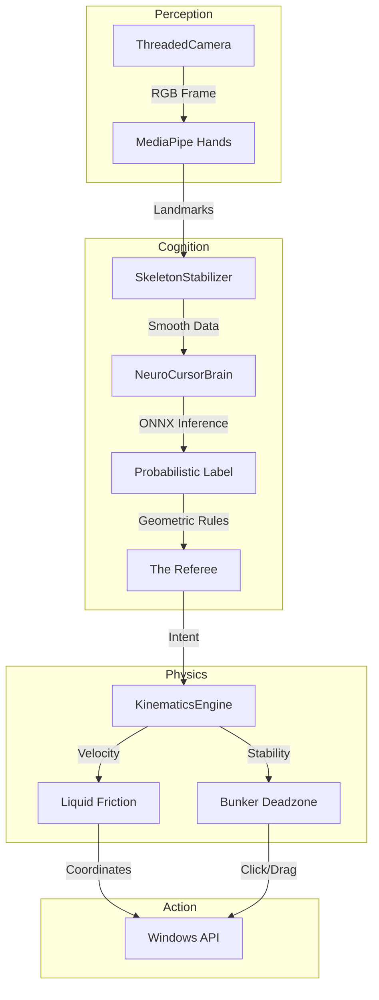
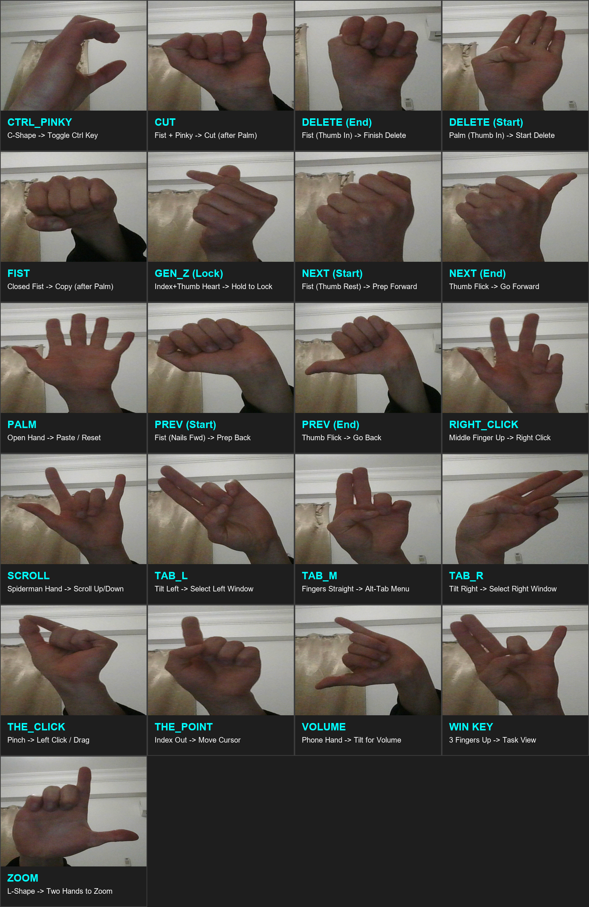

🖱️ **NeuroCursor: Physics-Based AI Interface**  
Touchless control that feels physical. Zero wearables. 100% Python.


---

### ⚡ The Problem: "The Jitter"  
Standard "Air Mouse" scripts are jittery and unusable. They map hand tremors directly to the screen, making it impossible to click small buttons (like the 'X' to close a window) without physical fatigue.

---

### 🧠 The Solution: NeuroCursor  
NeuroCursor is not just a CV script; it is a computational physics engine that sits between the AI and the OS. It treats the cursor as a physical object with mass, friction, and inertia.

---

### 🔑 Key Innovations

- **🌊 Liquid Friction**: A dynamic motion filter that adapts to velocity.  
  - *Slow Movement* → **High Friction (Honey)** → Pixel-Perfect Precision.  
  - *Fast Movement* → **Low Friction (Water)** → High Agility.

- **🛡️ The "Bunker" Deadzone**: A velocity-dependent gravity well. When you stop moving to pinch, the deadzone expands, locking the cursor to prevent "drift-clicks."

- **🏭 Custom ML Pipeline**: Trained on a refined dataset using a bespoke Unsupervised Learning pipeline to distinguish subtle gesture variations.

---

### 🛠️ System Architecture: The "Layer Cake"  
The system is engineered into five strictly decoupled layers to ensure scalability and testability.




| Layer        | Component           | Responsibility                                                                 |
|--------------|---------------------|--------------------------------------------------------------------------------|
| 1. Perception| ThreadedCamera      | Multithreaded I/O to decouple Vision FPS (30Hz) from Logic Loop.              |
| 2. Cognition | NeuroCursorBrain    | Hybrid inference engine (ONNX + Geometry Rules).                              |
| 3. Physics   | KinematicsEngine    | Calculates velocity, drag, and intention using squared-distance math.         |
| 4. Control   | NeuroController     | State machine managing complex interactions (Drag vs Click vs Scroll).        |
| 5. Action    | ActionDispatcher    | Low-level OS injection via pywin32.                                           |


## 🔬 The ML Pipeline: "Refined Supervision"
NeuroCursor uses a hybrid pipeline to ensure data quality before the Supervised training begins.

### 1. The Refinery (`02_data_refinery.py`)
An **Unsupervised Clustering** tool that cleans the raw data.
* **Weighted K-Means:** Clusters variations of a gesture to find outliers.
* **Anatomical Weighting:** Multiplies fingertip coordinates by **10x** before clustering. This forces the algorithm to focus on *intent* (fingers) rather than *noise* (wrist position).

### 2. The Academy (`04_train_model.py`)
Trains a **Supervised Deep Neural Network** on the refined data using:
* **Geometric Augmentation:** Randomly rotates skeletons +/- 10° to handle non-perfect posture.
* **Jitter Injection:** Adds synthetic noise to make the model robust against low-light sensor fuzz.
### 3. The Merger (`03_smart_merger.py`)  
Solves "Semantic Collapse." An interactive UI that allows the developer to merge micro-clusters (e.g., `PALM_VAR_1` and `PALM_VAR_2`) back into a single robust `PALM` class.

### 4. The Academy (`04_train_model.py`)  
Trains a Deep Neural Network with Geometric Augmentation:  
- **Jitter Injection**: Adds random noise to simulate shaky hands.  
- **Rotational Invariance**: Rotates skeletons ±10° to handle non-perfect posture.

### 3. Deployment (`05_convert_to_onnx.py`)
Converts the heavy Keras model to **ONNX (Open Neural Network Exchange)**.
* **Why?** TensorFlow is too heavy for a background mouse driver.
* **Result:** `onnxruntime` delivers **sub-5ms inference speeds** on a standard CPU, leaving the GPU free for other tasks.

---

🧪 **Engineering Labs (The Proof)**  
NeuroCursor includes a suite of visual calibration tools (`tools/`) used to tune the physics engine.

#### 1. The Stabilizer Lab (Layer 1)  
- **Problem**: Raw camera input is noisy and shaky.  
- **Solution**: A skeletal jitter filter acting as a "damper."  
- **Proof**: Notice the Grey Hand (Raw) shaking, while the green Hand and finally the blue (Processed) remains steady.


#### 2. The Motion Lab (Layer 2)  
- **Problem**: Smooth cursors feel "laggy."  
- **Solution**: Variable friction based on speed.  
- **Proof**: The Red Dot (Cursor) follows the White X (Hand) like a boat in water—agile when fast, stable when slow.


#### 3. The "Bunker" Lab (Layer 3)  
- **Problem**: Trying to double-click without moving the mouse (Drift).  
- **Solution**: A velocity-dependent gravity well.  
- **Proof**: Watch the Green Ring. When the hand stops, the ring expands, locking the cursor in place to allow a clean click. When movement starts, it shrinks instantly for agility.


---

✋ **The Gesture Language**  
NeuroCursor uses a strictly mapped language of 24 gestures, vetting every input through the "Geometric Referee" to prevent false positives.



### 🔒 System & Mouse

| Gesture     | Action                                      |
|-------------|---------------------------------------------|
| GEN_Z       | LOCK / UNLOCK System (Hold 1.5s).           |
| THE_POINT   | Move Cursor (Precision Mode).               |
| THE_CLICK   | Left Click / Drag (if held).                |
| RIGHT_CLICK | Right Click.                                |
| PALM        | Reset / Exit App (if locked).               |

---

### 🧭 Navigation & Shortcuts

| Gesture         | Action                                      |
|-----------------|---------------------------------------------|
| SCROLL          | Scroll (Spiderman Hand).                    |
| NEXT/PREV       | Browser Forward/Back (Fist → Thumb Flick).  |
| TAB_M           | Alt-Tab Menu.                               |
| TAB_L / R       | Select Window (Tilt Left/Right).            |
| FIST / CUT      | Copy / Cut (Context sensitive).             |
| VOLUME          | Volume Control (Phone Hand).                |
| ZOOM            | Zoom In/Out (L-Shape, Two Hands).           |
| THE_SHHH        | Mute System (Index on lips).                |

### 🚀 Getting Started

**Option 1: The App (Windows)**  
[Download the latest `.exe` release](https://github.com/IAmOmarJomaa/NeuroCursor/releases/tag/v1.0.0) — no Python installation required.

**Option 2: The Source (Developers)**  
**Prerequisites**: Python 3.11, Webcam.

### 🚀 Getting Started (Developer Setup)

1. **Clone the repository**
   ```bash
   git clone https://github.com/IAmOmarJomaa/NeuroCursor.git
   cd NeuroCursor
2. **Create Virtual Environment (Python 3.11 is critical)**
    ```bash
    py -3.11 -m venv venv
    .\venv\Scripts\activate

3. **Install Dependencies**
    ```bash
    pip install -r requirements.txt

4. **Run the System**    
    ```bash
    python -m run

### Engineered by Omar Jomaa ⚙️  
### Powered by Caffeine ☕
